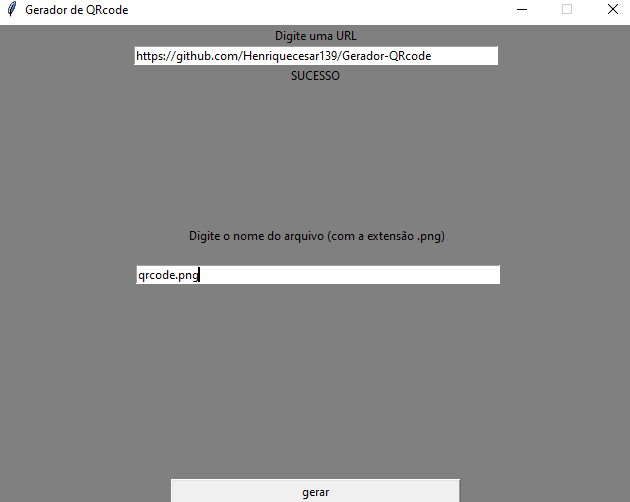

<h1>Gerador de QRcode feito com python</h1>

<h2>Interface gráfica feita com Tkinter</h2>

Como Usar

Digite a URL que deseja transformar em QRcode

Digite um nome para o arquivo <strong>(coloque a extensão .png )</strong> 

Aperte o Botão Gerar

Como funciona

O botão dispara uma função

A função captura os parâmetros (URL e nome do arquivo)

A função usa esses parâmetros e gera um QRcode

O QRcode será salvo na mesma pasta que o arquivo

